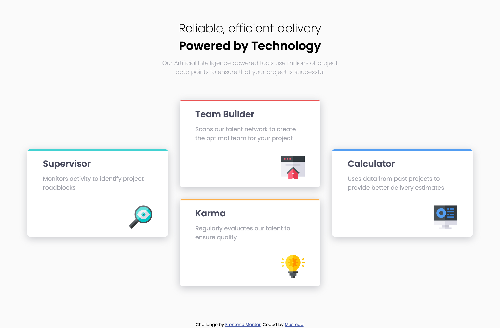
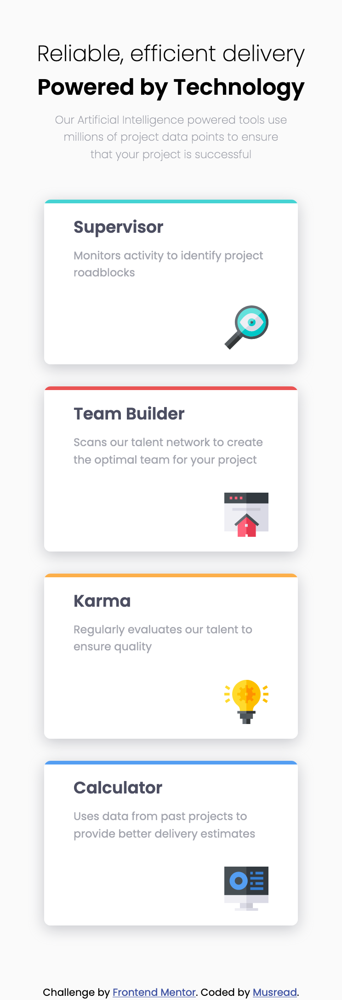

# Four card feature section solution

**Hi everyone 👋 !**

Here we go again. This is another solution for a [FrontendMentor](https://www.frontendmentor.io) challenge.

## Table of contents

- [Overview](#overview)
  - [The challenge](#the-challenge)
  - [Screenshots](#screenshots)
  - [Links](#links)
- [My process](#my-process)
  - [Built with](#built-with)
- [Author](#author)
- [Acknowledgements](#acknowledgments)

## Overview

### The challenge

This time, it's about making a **4-card feature section**. You can see the challenge [here](https://www.frontendmentor.io/challenges/four-card-feature-section-weK1eFYK/hub).

### Screenshot

This is my solution for desktop screens:

And this is for mobile screens:

### Links

- Live Site URL: https://musread.github.io/four-card-section/

## My process

### Built with

- Semantic HTML5 markup
- CSS custom properties
- Flexbox
- CSS Grid
- Node Modules

## Author

- GitHub - https://github.com/Musread
- Frontend Mentor - [@musread](https://www.frontendmentor.io/profile/musread)

## Acknowledgments

For building the content layout, I get inspired by another FrontendMentor warrior, @Nathan-Front, and his solution for this challenge that you can see [here](https://github.com/Nathan-Front/four-card-feature-section-master). **Thank you @Nathan-Front** 👍
